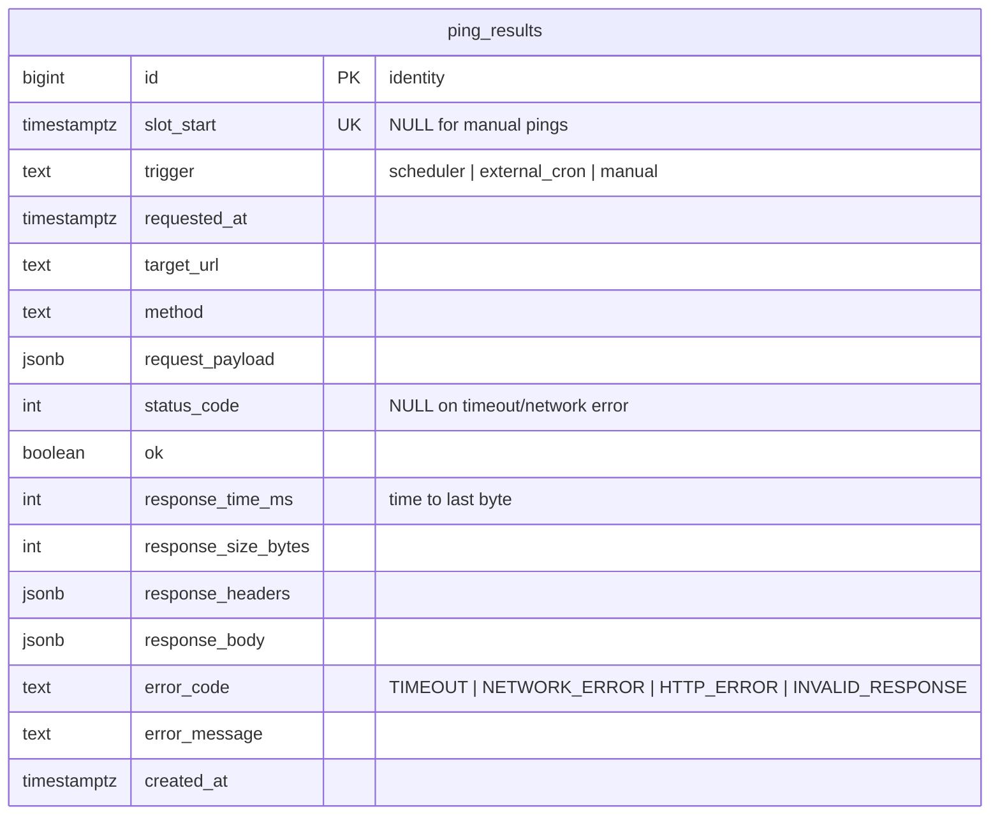

# Database

PostgreSQL 17 (Docker locally, Supabase in production), accessed through Drizzle ORM. Migrations live in `apps/api/drizzle/` and are generated from `apps/api/src/db/schema.ts` (`pnpm --filter @bizscout/api db:generate`). Never edit an applied migration.

## Entity diagram

## `ping_results`

| Column                                             | Why it exists                                                                                            |
| -------------------------------------------------- | -------------------------------------------------------------------------------------------------------- |
| `id` (identity)                                    | Monotonic → keyset pagination cursor and SSE `Last-Event-ID`                                             |
| `slot_start` (unique)                              | Idempotency key: scheduler and external cron can both fire for the same 5-minute slot; only one row wins |
| `trigger`                                          | Tells scheduled, cron-backfilled and manual pings apart when debugging gaps                              |
| `request_payload` (jsonb)                          | The random body we sent, for reproducibility and for checking the echo                                   |
| `response_body` / `response_headers` (jsonb)       | Full httpbin echo; unknown shape, so JSONB instead of columns                                            |
| `ok`, `status_code`, `error_code`, `error_message` | Failure classification from the probe client                                                             |
| `response_time_ms`, `response_size_bytes`          | The metrics we chart and alert on                                                                        |

## Indexes

| Index                                  | Serves                                                                                                        |
| -------------------------------------- | ------------------------------------------------------------------------------------------------------------- |
| PK `id`                                | Newest-first lists (`ORDER BY id DESC`), cursor pagination, SSE replay (`id > $1`)                            |
| `ping_results_slot_start_key` (unique) | Slot idempotency (`ON CONFLICT (slot_start) DO NOTHING`); NULLs don't collide, so manual pings are unaffected |
| `ping_results_requested_at_idx` (desc) | Stats/series windows (`requested_at BETWEEN …`)                                                               |
| `ping_results_ok_requested_at_idx`     | "Failures in range" queries                                                                                   |

## Sizing

288 pings/day × ~2 KB (payload + echo) ≈ 0.6 MB/day ≈ 18 MB/month: comfortably inside Supabase's free 500 MB. A daily retention job (Phase 5) keeps 30 days by default.
