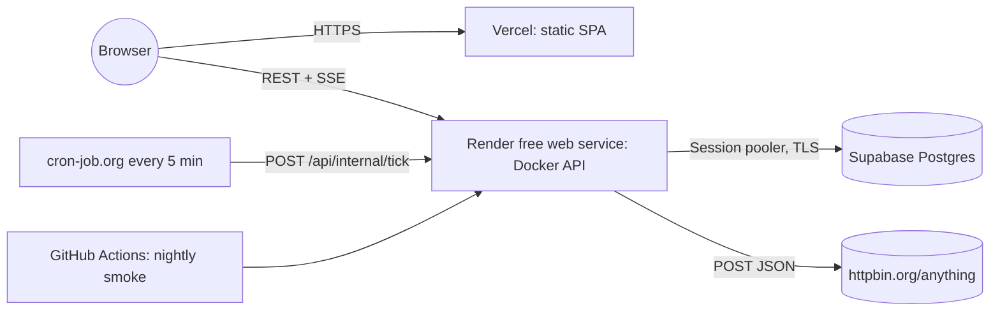

# Deployment

## Topology

| Piece      | Where                                      | Cost |
| ---------- | ------------------------------------------ | ---- |
| API        | Render free web service (Docker, `oregon`) | $0   |
| Database   | Supabase free project (Session pooler)     | $0   |
| Dashboard  | Vercel Hobby                               | $0   |
| Keep-alive | cron-job.org                               | $0   |

## First-time setup (≈ 30 minutes)

1. **Supabase**: create project, copy the _Session pooler_ URL, run `DATABASE_URL=… DATABASE_SSL=true pnpm --filter @bizscout/api db:migrate`.
2. **Render**: New → Blueprint → this repo; set `DATABASE_URL`, `CORS_ORIGINS`; wait for a green deploy; copy the generated `INTERNAL_API_TOKEN`.
3. **Vercel**: import repo, root `apps/web`, env `VITE_API_BASE_URL` + `ENABLE_EXPERIMENTAL_COREPACK=1`; deploy.
4. **Render**: set `CORS_ORIGINS` to the Vercel URL(s).
5. **cron-job.org**: POST `…/api/internal/tick` every 5 min with header `x-internal-token`.
6. **GitHub**: secret `API_URL`; variable `WEB_URL` (used by the nightly smoke workflow).
7. Run `scripts/smoke.sh <api> <web>`.

## Continuous delivery

- **API**: merge to `main` → CI (`quality`, `api`, `web`, `e2e`, `docker`) → Render auto-deploys on green checks → boot runs migrations → health check gates traffic.
- **Web**: Vercel builds every push; `main` → production, PRs → preview URLs (allowed by the wildcard CORS entry).

## Environment variables

### API (Render)

| Variable                 | Required | Default                        | Notes                                             |
| ------------------------ | -------- | ------------------------------ | ------------------------------------------------- |
| `NODE_ENV`               | prod     | `development`                  | `production` in the image and on Render           |
| `APP_VERSION`            | no       | `dev`                          | Reported by `/api/health`                         |
| `DATABASE_URL`           | yes      | —                              | Supabase **Session pooler** URL                   |
| `DATABASE_SSL`           | prod     | `false`                        | `true` for Supabase                               |
| `DATABASE_POOL_MAX`      | no       | `5`                            | Keep small on free tiers                          |
| `RUN_MIGRATIONS_ON_BOOT` | no       | `false`                        | `true` in prod (free tier has no pre-deploy hook) |
| `MIGRATIONS_DIR`         | no       | `./drizzle`                    | Relative to the working dir                       |
| `CORS_ORIGINS`           | yes      | `http://localhost:5173`        | Comma-separated; `*` = one DNS label              |
| `HTTPBIN_URL`            | no       | `https://httpbin.org/anything` | Ping target                                       |
| `PING_INTERVAL_MS`       | no       | `300000`                       | 5 minutes                                         |
| `PING_TIMEOUT_MS`        | no       | `10000`                        | Probe timeout                                     |
| `SCHEDULER_ENABLED`      | no       | `true`                         | `false` in E2E                                    |
| `RETENTION_DAYS`         | no       | `30`                           | Daily sweep at 00:00 UTC; `0` disables            |
| `INTERNAL_API_TOKEN`     | prod     | —                              | ≥ 24 chars; guards `/api/internal/*`              |
| `LOG_LEVEL`              | no       | `info`                         | pino level                                        |
| `PORT`                   | auto     | `4000`                         | Render injects it                                 |

### Web (Vercel, build time)

| Variable                       | Required | Notes                              |
| ------------------------------ | -------- | ---------------------------------- |
| `VITE_API_BASE_URL`            | yes      | API origin, no trailing slash      |
| `ENABLE_EXPERIMENTAL_COREPACK` | yes      | `1`, so the pinned pnpm 11 is used |

## Operations

- **Logs**: Render → Logs (JSON; filter `"msg":"ping recorded"` / `"level":50`).
- **Rollback**: Render → Deploys → _Rollback_ to a previous image; Vercel → Deployments → _Instant Rollback_.
- **Migrations**: generated SQL in `apps/api/drizzle`, applied on boot, forward-only. A destructive change ships as expand → migrate → contract across two deploys. Each statement must finish within the pool's 15 s `query_timeout`; `Query read timeout` in the logs means a query (or migration statement) hit it.
- **Retention**: a sweep at 00:00 UTC deletes pings older than `RETENTION_DAYS` (log line `"msg":"retention sweep complete"` with the count). It does not run on boot; a sweep missed because the instance was asleep or restarting at midnight is covered by the next one, which deletes everything past the cutoff.
- **Rotate the internal token**: Render env → new value → update the cron-job.org header.

## Free-tier limitations & mitigations

| Limitation                                                                                          | Mitigation                                                                                                                                       |
| --------------------------------------------------------------------------------------------------- | ------------------------------------------------------------------------------------------------------------------------------------------------ |
| Render sleeps after ~15 min idle; cold start ~30–60 s                                               | 5-minute external tick keeps it warm; boot catch-up + idempotent tick backfill the slot                                                          |
| Render restarts on deploy (in-flight SSE drops)                                                     | EventSource auto-reconnects; `Last-Event-ID` replay                                                                                              |
| Supabase pauses projects after 7 days of _inactivity_                                               | Our 5-minute writes are activity                                                                                                                 |
| Supabase direct connection is IPv6-only                                                             | Session pooler (IPv4)                                                                                                                            |
| Single instance (in-memory bus)                                                                     | Acceptable at this scale; see ADR-0003 for LISTEN/NOTIFY                                                                                         |
| GitHub disables scheduled workflows after 60 days without repository activity                       | The nightly smoke workflow may pause; re-enable it under Actions. cron-job.org (not GitHub) is the sole keep-alive tick, so uptime is unaffected |
| cron-job.org is the sole keep-alive source (no backup cron; `keepalive.yml` was removed 2026-09-28) | Watch cron-job.org's own failure-notification email after any outage                                                                             |

## Troubleshooting

- **CORS error in the browser**: `CORS_ORIGINS` doesn't include the exact dashboard origin (scheme + host, no trailing slash). The preview wildcard `https://bizscout-monitor-*.vercel.app` also admits any other Vercel project whose name starts with `bizscout-monitor-`; that's acceptable because the API serves public data, uses no cookies or credentials, and its internal endpoints need the token.
- **Stream connects but no events**: check a proxy isn't buffering (`X-Accel-Buffering: no` is sent). Heartbeats should appear every 25 s with `curl -N`.
- **`ENETUNREACH` / connection timeouts to Supabase**: you used the direct (IPv6) URL; switch to the Session pooler.
- **Deploy stuck unhealthy**: `/api/health` returns 503 when the DB is unreachable; check `DATABASE_URL` / `DATABASE_SSL`.
